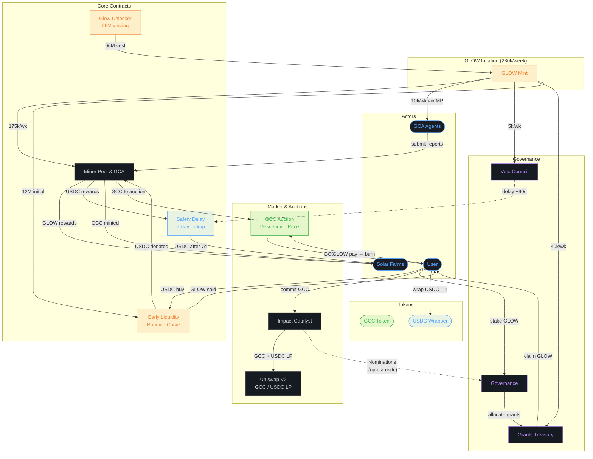
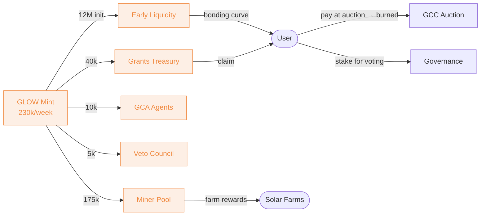
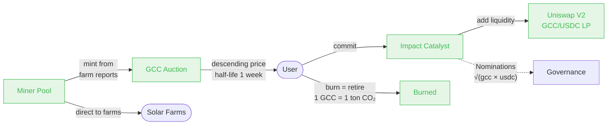
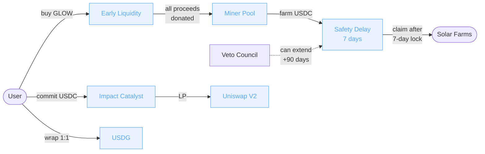

# Glow Protocol — Token Flow Visualization

## Full System Overview

## GLOW Token Flows

## GCC Token Flows

## USDC Flows

## Key Mechanics

| Mechanism | Details |
|-----------|---------|
| **GLOW Inflation** | 230k/week split: 175k Miners, 40k Grants, 10k GCAs, 5k Veto |
| **Early Liquidity** | Price = $0.003 × 2^(sold/1M), 12M supply |
| **GCC Minting** | 1 GCC = 1 ton CO₂, minted from validated farm reports |
| **GCC Auction** | Reverse Dutch auction, 0.1 GLOW start, 1-week half-life decay |
| **Nominations** | √(gcc_committed × usdc_received), used for proposals & votes |
| **Safety Delay** | 7-day USDC lockup, Veto can extend to 97 days |
| **GLOW Staking** | Stake for governance votes, 5-year unstake cooldown |
| **GCC Burning** | Permanently retire carbon credits, tracked on-chain |
